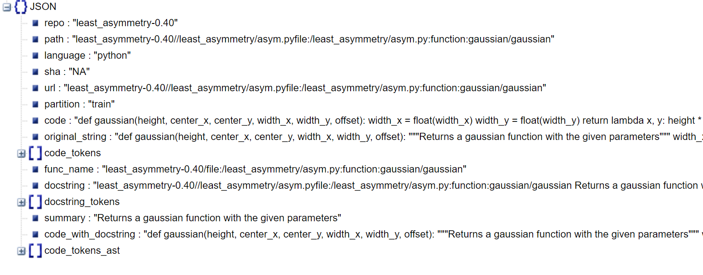

# PyTorrent schema

## The downloaded data (For example PyTorrent_Both_Docstrings_UserComments.zip) will have the following folder structure:
```
PyTorrent_Both_Docstrings_UserComments
└───both
    ├───test (contains test_scenario_both_*.jsonl.gz files)
    ├───train (contains train_scenario_both_*.jsonl.gz files)
    └───valid (contains valid_scenario_both_*.jsonl.gz files)
```

## Each *.gz file contains a *.jsonl file. Each *.jsonl file contains many json entries (each representing a <P, NL>)

```
Below is an example of a JSON entry in a jsonl (JSON-Newline) file (train_scenario_both_chk_0.jsonl)
```


## As specified in the paper the schema is largely similar to [CodeSearchNet](https://github.com/github/codesearchnet#schema--format)

We utilize those attributes as follows:

* **repo**: the python package
* **path**: the relative path to the specific python script within that package
* **language**: the programming language (python, in future, maybe other languages)
* **SHA**: not applicable as we are not mining from GitHub repositories
* **url**: the relative path of the python function/code
* **partition**: a label to denote the part of the data (similar to CodeSearchNet)
* **code**: the part of the original_string that is code (similar to CodeSearchNet)
* **original_string**: the raw string before tokenization or parsing (similar to CodeSearchNet)
* **code_tokens**: tokenized version of code (similar to CodeSearchNet)
* **func_name**: the function or method name with path
* **docstring_tokens**: tokenized version of docstring
* **docstring**: the entire raw docstring
* **code_tokens_ast**: tokenize code based on python tokenizer (it is used for Code Generation tasks)  (<font color="green">new</font>)
* **code_with_docstrings**: capture both codes and its docstrings (<font color="green">new</font>)
* **summary**: a summary of docsctrings (<font color="green">new</font>)
